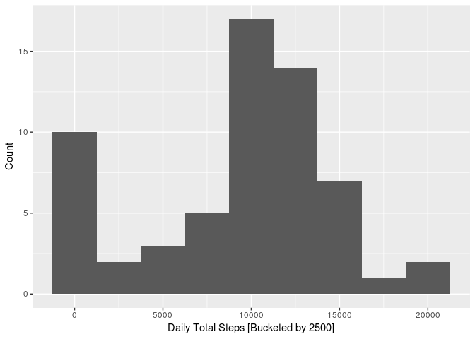
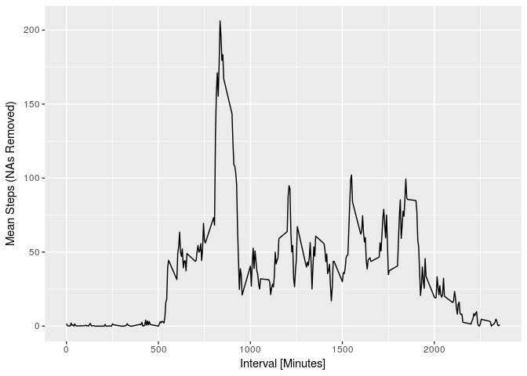
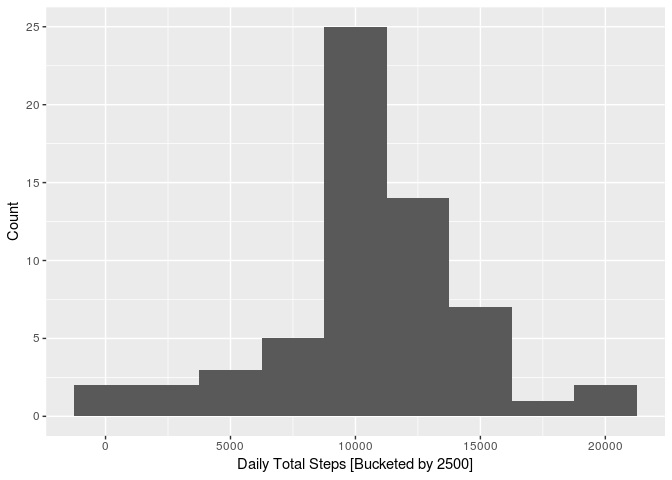
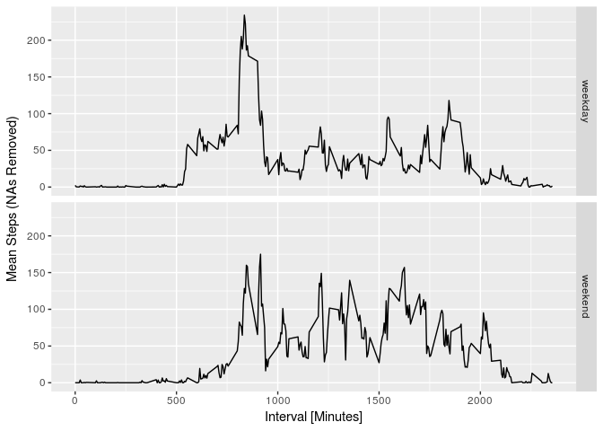

# Reproducible Research: Peer Assessment 1
Load the below libraries:

```r
  library(dplyr)
  library(ggplot2)
  library(lubridate)
```
##Loading and preprocessing the data
1. Download the Activity Tracker dataset for Project 1

```r
temp 	<- tempfile()
url		<- "https://d396qusza40orc.cloudfront.net/repdata%2Fdata%2Factivity.zip"
download.file(url,temp)
data 	<- read.csv(unz(temp, "activity.csv"), stringsAsFactors=FALSE)
unlink(temp)
```
2. Process/transform the data (if necessary) into a format suitable for your analysis

```r
data <- data %>%
  mutate(
    date=as.Date(date))                                           #convert date to R date type
    #,isWeekday=ifelse(wday(date)==1 | wday(date)==7,FALSE,TRUE)) #check if a weekday
head(data,10)
```

```
##    steps       date interval
## 1     NA 2012-10-01        0
## 2     NA 2012-10-01        5
## 3     NA 2012-10-01       10
## 4     NA 2012-10-01       15
## 5     NA 2012-10-01       20
## 6     NA 2012-10-01       25
## 7     NA 2012-10-01       30
## 8     NA 2012-10-01       35
## 9     NA 2012-10-01       40
## 10    NA 2012-10-01       45
```
##What is mean total number of steps taken per day?
1. Calculate the total number of steps taken per day

```r
dailyData<- data %>%
  group_by(date) %>%
  summarise(
    dailyTotalSteps=sum(steps,na.rm=TRUE)
    ,dailyMeanSteps=mean(steps,na.rm=TRUE)
    ,dailyMedianSteps=median(steps,na.rm=TRUE)
  ) %>%
  ungroup() 
```
2.  Make a histogram of the total number of steps taken each day

```r
ggplot(dailyData, aes(x=dailyTotalSteps)) + 
  geom_histogram(binwidth=2500) +
  xlab("Daily Total Steps [Bucketed by 2500]") + 
  ylab("Count")
```

<!-- -->

3. Calculate and report the mean and median of the total number of steps taken per day

```r
theMean   <- round(mean(dailyData$dailyTotalSteps),0)
theMedian <- median(dailyData$dailyTotalSteps)
```
The mean is 9354, and the median is 10395

##What is the average daily activity pattern?
1. Make a time series plot of the 5-minute interval (x-axis) and the average number of steps taken, averaged across all days (y-axis)

```r
intervalData<- data %>%
  group_by(interval) %>%
  summarise(
    meanSteps=mean(steps,na.rm=TRUE)
  ) %>%
  ungroup() 

ggplot(data=intervalData, aes(x=interval, y=meanSteps)) +
   geom_line() +
   xlab("Interval [Minutes]") + ylab("Mean Steps (NAs Removed)")
```

<!-- -->

2. Which 5-minute interval, on average across all the days in the dataset, contains the maximum number of steps?

```r
maxInterval <- intervalData %>% 
  arrange(desc(meanSteps)) %>% 
  head(1)
```
The max interval period is 835

##Imputing missing values
Note that there are a number of days/intervals where there are missing values (coded as NA). The presence of missing days may introduce bias into some calculations or summaries of the data.

1. Calculate and report the total number of missing values in the dataset (i.e. the total number of rows with NAs)

```r
countNA <- sum(is.na(data$steps))
```
There are 2304 rows with missing data.
2. Devise a strategy for filling in all of the missing values in the dataset. We replace the NA with the mean steps of its interval. and 3. Create a new dataset that is equal to the original dataset but with the missing data filled in.

```r
completeData <- data %>%
  group_by(interval) %>%
  mutate(avgSteps=ceiling(mean(steps,na.rm=TRUE))
         ,steps=ifelse(!is.na(steps),steps,avgSteps)
         ) %>%
  ungroup() %>%
  group_by(date) %>%
  summarise(dailyTotalSteps=sum(steps)) %>%
  ungroup()
theMean   <- as.integer(mean(completeData$dailyTotalSteps))
theMedian <- as.integer(median(completeData$dailyTotalSteps))
head(completeData,10)
```

```
## # A tibble: 10 × 2
##          date dailyTotalSteps
##        <date>           <dbl>
## 1  2012-10-01           10909
## 2  2012-10-02             126
## 3  2012-10-03           11352
## 4  2012-10-04           12116
## 5  2012-10-05           13294
## 6  2012-10-06           15420
## 7  2012-10-07           11015
## 8  2012-10-08           10909
## 9  2012-10-09           12811
## 10 2012-10-10            9900
```

4. Make a histogram of the total number of steps taken each day and Calculate and report the mean and median total number of steps taken per day. Do these values differ from the estimates from the first part of the assignment? What is the impact of imputing missing data on the estimates of the total daily number of steps?

```r
ggplot(completeData, aes(x=dailyTotalSteps)) + 
  geom_histogram(binwidth=2500) +
  xlab("Daily Total Steps [Bucketed by 2500]") + 
  ylab("Count")
```

<!-- -->

The mean is 10784, and the median is 10909

Since we have replaced the NAs with the mean of the associated hour, the mean and median of the final set has increased.

##Are there differences in activity patterns between weekdays and weekends?

1. Create a new factor variable in the dataset with two levels – “weekday” and “weekend” indicating whether a given date is a weekday or weekend day.

```r
library(lubridate)
intervalData <- data %>%
  mutate(
     type=as.factor(ifelse(wday(date)==1 | wday(date)==7,"weekend","weekday"))) %>%
  group_by(interval,type) %>%
  summarise(
     meanSteps=mean(steps,na.rm=TRUE)
  ) %>%
  ungroup() 
head(intervalData,10)
```

```
## # A tibble: 10 × 3
##    interval    type meanSteps
##       <int>  <fctr>     <dbl>
## 1         0 weekday 2.3333333
## 2         0 weekend 0.0000000
## 3         5 weekday 0.4615385
## 4         5 weekend 0.0000000
## 5        10 weekday 0.1794872
## 6        10 weekend 0.0000000
## 7        15 weekday 0.2051282
## 8        15 weekend 0.0000000
## 9        20 weekday 0.1025641
## 10       20 weekend 0.0000000
```

2. Make a panel plot containing a time series plot (i.e. type = "l") of the 5-minute interval (x-axis) and the average number of steps taken, averaged across all weekday days or weekend days (y-axis). 


```r
ggplot(data=intervalData, aes(x=interval, y=meanSteps)) +
   geom_line() + facet_grid(type ~ .) +
   xlab("Interval [Minutes]") + ylab("Mean Steps (NAs Removed)") 
```

<!-- -->


